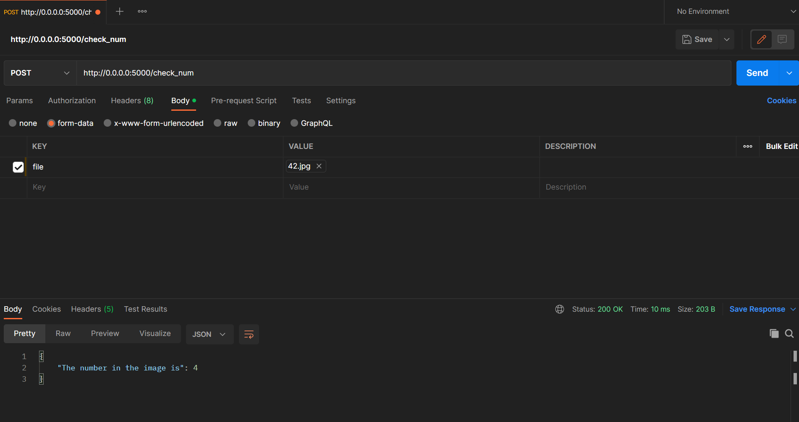

# MNIST_RECOGNIZER_APP

## Usage
Clone repository
``` 
git clone https://github.com/ambirpatel/mnist_app.git
```

Create environment
```
pip install -r requirements.txt
```

For training use train.ipynb

If you want to run flask app for prediction

1. Build docker image from given dockerfile
```
 docker build --tag <image_name> .
```
2. Run the docker image
```
 docker run -d -p 5000:5000 <image_name>
```
After this app will run on 5000 port on your localhost. The endpoint for taking inference is 'http://0.0.0.0:5000/check_num'


### Sample image used for testing

### Testing app using postman

